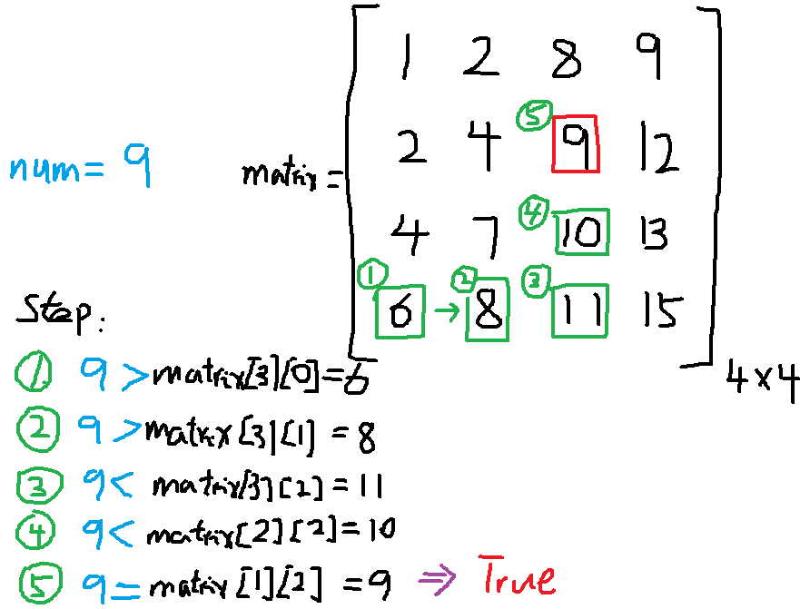

# 题目描述

在一个二维数组中，每一行都按照从左到右递增的顺序排序，每一列都按照从上到下递增的顺序排序。
请完成一个函数，输入这样的一个二维数组和一个整数，判断数组中是否含有该整数。

# 解题思路

根据题目信息，可以知道输入和输出信息如下：

- 输入: 二维数组和待查询的整数 
- 输出: 待查询整数是否在二维数组(True, False)

已经二维数组是称规律排列，我们可以先确定一个查询起点，再根据已知的排列规律进行查询。如将二维数组左下角元素作为查询起点，比较左下角元素与待查询数值的大小，如果左下角元素小于待查询数值，则根据排列规则，应该将列数+1。再进行比较，直到左下角元素大于待查询数值，此时即可以将行数-1。继续查询，直到左下角元素等于待查询数值，即可返回True，反之，返回False。

# 解题步骤

	二维数组matrix, 二维数组行数: rows，二维数组列数: cols, 待查询数值num

	1.先将二维数组转换成一维数组进行处理
	2.定义判断初始值为左下角元素matrix[row][col]，其中row=rows-1, col=0
	3.将二维数组的左下角元素matrix[row][col]（或者右上角元素）值与带查询num进行比较，
	  如果matrix[row][col] > num，则--row；如果matrix[row][col] < num，则++col。
	4.重复第3步，直到遍历完所有可以遍历的数组元素。

举个栗子，如下图所示（图虽然有点丑，但应该能看懂，嘻嘻）



# 代码

[C++](FindInPartiallySortedMatrix.cpp)

```c++
class Solution {
public:
	bool Find(int target, vector<vector<int> > array) {
		int matrix_rows = array.size();        // 二维数组行数
		int matrix_cols = array[0].size();     // 二维数组列数
		int row = matrix_rows - 1;
		int col = 0;
		// 判断输入的二维数组是否符合要求
		if (matrix_rows == 0 && matrix_cols == 0)
			return false;
		// 循环
		while (row >= 0 && col < matrix_cols)
		{    // 比较当前元素和待查询元素大小
			if (target < array[row][col])
			{
				--row;    // 减行
			}
			else if (target > array[row][col])
			{
				++col;    // 加列
			}
			else
				return true;
		}
		return false;
	}
};
```


[Python](FindInPartiallySortedMatrix.py)

```python
# -*- coding:utf-8 -*-
class Solution:
    # array 二维列表
    def Find(self, target, array):
        # write code here
        # 计算数组的行列
        rows = len(array)    # 计算行数
        cols = len(array[0]) # 计算列数
        
        if rows<=0 or cols<=0:
            return False
        
        row = rows-1
        col = 0
        
        while row >=0 and col <cols:
            if array[row][col] < target:
                col = col+1
            elif array[row][col] > target:
                row = row-1
            else:
                return True
        return False
```


TODO

	版本1: 仍需要人为输入二维数组的行和列，太不智能化