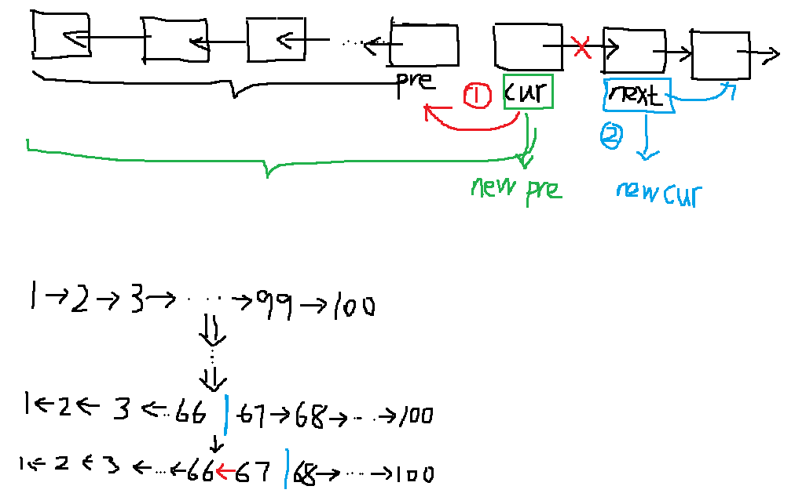

# 题目描述

输入一个链表，反转链表后，输出新链表的表头。

# 解题思路

此题考查[链表](https://github.com/amusi/coding-note/blob/master/Coding%20Interviews/05_PrintListInReversedOrder/Linkedlist.md)知识点。

链表一般是由多个结点组成，除了首结点和尾结点外，所有的结点都有前后相连的结点。那么如何将一个链表进行反转呢？我们可以利用链表自身特性来解决。

我们定义pre、cur和post三个结点来求解此题，分别表示前结点，当前结点和后结点。输入的顺序是：pre->cur->post。因为是反转，所以我们应该将cur指向pre，然后将cur作为新的pre，而post作为新的cur。此时，新的pre是原pre、cur反转后的结果。经过多次迭代，直到cur==NULL时，输出pre即可。

**举个栗子：**

如下图所示，哈哈，虽然画风很奇怪，但我想不用赘述，结合上述解释、图示和代码，相信你可以理解。

注：

- 反转时，pre和cur、post是断开的，这个最好画图来理解。


- while循环的判断语句要注意，一定要遍历完所有结点。




# 代码

[C++](KthNodeFromEnd.cpp)

```c++
/*
struct ListNode {
	int val;
	struct ListNode *next;
	ListNode(int x) :
			val(x), next(NULL) {
	}
};*/
class Solution {
public:
    // 思路: 将列表进行反转
    ListNode* ReverseList(ListNode* pHead) {
        if(pHead==NULL || pHead->next==NULL)
            return pHead;
        
        ListNode* cur = pHead;
        ListNode* pre = NULL;    // ListNode* pre = NULL;
        ListNode* post = NULL;    // ListNode* post = pHead->next;
        while (cur!=NULL){
            post = cur->next;
            cur->next = pre;
            pre = cur;
            cur = post;
        }
        pHead = pre;
        return pHead;
    }
};
```

[Python](KthNodeFromEnd.py)

```python
# -*- coding:utf-8 -*-
# class ListNode:
#     def __init__(self, x):
#         self.val = x
#         self.next = None
class Solution:
    # 返回ListNode
    # 思路: 即将链表进行反转
    def ReverseList(self, pHead):
        # write code here
        # 输入判断
        if pHead == None or pHead.next == None:
            return pHead
        pre = None
        cur = pHead
        while cur:
            post = cur.next
            cur.next = pre
            pre = cur
            cur = post
        return pre
```

# 参考

https://blog.csdn.net/u013271921/article/details/46382345