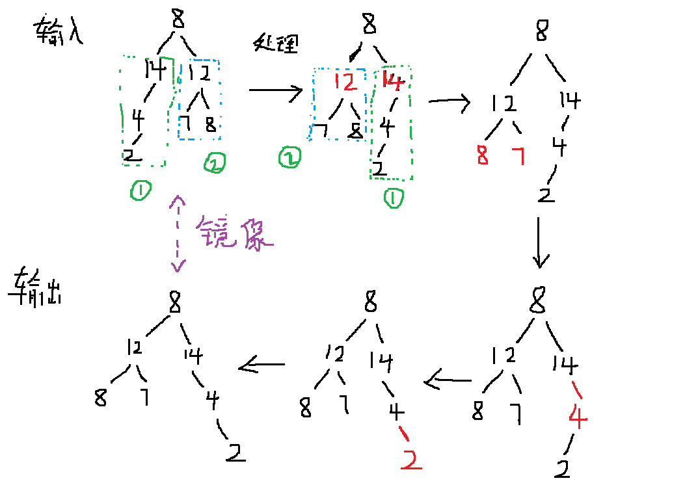

# 题目描述

操作给定的二叉树，将其变换为源二叉树的镜像。

输入描述：

```
二叉树的镜像定义：
源二叉树
    	    8
    	   /  \
    	  6   10
    	 / \  / \
    	5  7 9 11

镜像二叉树
    	    8
    	   /  \
    	  10   6
    	 / \  / \
    	11 9 7  5
```

# 解题思路

此题考查[二叉树](https://github.com/amusi/coding-note/blob/master/Coding%20Interviews/06_ConstructBinaryTree/Binarytree.md)知识点。

**递归法：**

我们先前序遍历这棵树的每个结点，如果遍历到的结点有子结点，就交换它的两个子结点（交换两个子结点的写法和交换两个变量值的思路是一样的，设置一个中间变量即可）。当交换完所有非叶子结点的左右子结点后，就得到了数的镜像。

注：但遍历到叶子结点后，不需要做任何处理（这个思想很关键）。

这里就不详细展开描述，下面放一幅手绘图像，简单说明。



如何找到相同的结点呢？那就需要遍历二叉树了。

如何遍历二叉树呢？那就分别从左子树和右子树开始遍历。

此题的关键点在于使用“递归法”和对二叉树遍历的理解（左子树和右子树）。

注：递归法真的很重要！很重要！编写的时候一定要搞清楚输入是什么，输出是什么？以及何时停止问题。

扩展知识点：二叉树的三种遍历方法（前序遍历、中序遍历和后序遍历）

# 代码

[C++](SubstructureInTree.cpp)

递归法

```c++
/*
struct TreeNode {
	int val;
	struct TreeNode *left;
	struct TreeNode *right;
	TreeNode(int x) :
			val(x), left(NULL), right(NULL) {
	}
};*/
class Solution {
public:
    // 思路: 左右非子结点互换
    // 递归法
    void Mirror(TreeNode *pRoot) {
        // 判断输入是不是空树
        if(pRoot == NULL)
            return;
        // 判断是不是遍历到了叶子结点（叶子结点无子结点）
        if(pRoot->left==NULL && pRoot->right==NULL)
            return;
        // 交换非叶子结点
        TreeNode *pTemp = pRoot->left;
        pRoot->left = pRoot->right;
        pRoot->right = pTemp;
        
        // 如果是非叶子结点，则继续递归
        if(pRoot->left!=NULL)
            Mirror(pRoot->left);
        if(pRoot->right!=NULL)
            Mirror(pRoot->right);
            
    }
};
```

循环法（非递归法）

```c++
/*
struct TreeNode {
	int val;
	struct TreeNode *left;
	struct TreeNode *right;
	TreeNode(int x) :
			val(x), left(NULL), right(NULL) {
	}
};*/
class Solution {
public:
    // 思路: 左右非子结点互换
    void Mirror(TreeNode *pRoot) {
        // 循环法（非递归）
        if(pRoot==NULL)
            return;
        stack<TreeNode*> stackNode;
        stackNode.push(pRoot);
        while(stackNode.size()){
            TreeNode* tree=stackNode.top();
            stackNode.pop();
            if(tree->left!=NULL || tree->right!=NULL){
                TreeNode *ptemp=tree->left;
                tree->left=tree->right;
                tree->right=ptemp;
            }
            if(tree->left)
                stackNode.push(tree->left);
            if(tree->right)
                stackNode.push(tree->right);
        }
    }
};
```


[Python](SubstructureInTree.py)

递归法

```python
# -*- coding:utf-8 -*-
# class TreeNode:
#     def __init__(self, x):
#         self.val = x
#         self.left = None
#         self.right = None
class Solution:
    # 返回镜像树的根节点
    def Mirror(self, root):
        # write code here
        if root==None:
            return
        #(可选) 判断是不是叶子结点
        if root.left==None and root.right==None:
            return
        # 交换非叶子结点
        temp = root.left
        root.left = root.right
        root.right = temp
        # 如果不是非叶子结点，继续递归
        if root.left!=None:
            self.Mirror(root.left)
        if root.right!=None:
            self.Mirror(root.right)
```

# 参考

https://www.nowcoder.com/questionTerminal/6e196c44c7004d15b1610b9afca8bd88