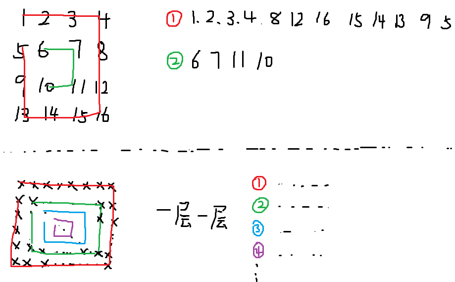

# 题目描述

输入一个矩阵，按照从外向里以顺时针的顺序依次打印出每一个数字，例如，如果输入如下矩阵： 1 2 3 4 5 6 7 8 9 10 11 12 13 14 15 16 则依次打印出数字1,2,3,4,8,12,16,15,14,13,9,5,6,7,11,10.

# 解题思路

**方法1：圈圈打印法**

我们可以把矩阵想象成若干个圈。于是可以通过一个循环来打印矩阵，每一次打印矩阵中的一个圈。

这种方法比较容易想到，很直观。但难度在于设定循环的限制条件，如：

1. 每次打印一个圈，那么什么时候停止打印呢？
2. 打印一个圈的时候，该圈到哪里就停止了呢？

接下来分析第一个问题：分析循环结束的条件。假设这个矩阵的行数是rows，列数是columns。打印第一圈的左上角的坐标是（0,0），第二圈的左上角的坐标是（1,1），依次类推。我们注意到，左上角的坐标中行标和列标总是相同的，于是在矩阵中选取左上角为（start, start）的一圈作为我们分析的目标。

参考：《剑指Offer》p128

第二个问题：如何打印一个圈，停止条件是什么？

这里，我就不赘述，因为这是最核心的问题，其实看了下面图像，稍微比划着也就知道如何打印了。但要注意的是，打印一个圈，不一定有多个元素，也许就一个元素，所以要注意条件。



**方法2：旋转矩阵法**

该方法技巧性很足，请参考下面的Python代码好好体会，这里不赘述。

# 代码

[C++](PrintMatrix.cpp)：方法1

```c++
class Solution {
public:
    // 思路: 
    vector<int> printMatrix(vector<vector<int> > matrix) {
        if (matrix.size()==0)
            return matrix[0];
        vector<vector<int>> resultMatrixTemp;
        vector<int> resultMatrix;    // 最终输出值
        int rows = matrix.size();        // 矩阵行数
        int columns = matrix[0].size();  // 矩阵列数
        // 设置起始位置
        int start = 0;    // start = start_x = start_y
        //resultMatrix.resize(rows*columns);
        // 根据关系式判断
        while(columns > 2*start && rows > 2*start){
            resultMatrixTemp.push_back(printMatrixInCircle(matrix, start));
            ++start;
        }
        for(int i=0; i<resultMatrixTemp.size(); ++i){
            for(int j=0; j<resultMatrixTemp[i].size(); ++j){
                resultMatrix.push_back(resultMatrixTemp[i][j]);
            }
        }
        return resultMatrix;
    }
    
    vector<int> printMatrixInCircle(vector<vector<int> >matrix, int start){
        if (matrix.size()==0)
            return resultMatrix;
        vector<int> resultMatrix;
        int rows = matrix.size();
        int columns = matrix[0].size();
        
        int endX = columns-1-start;	// 水平方向终点
        int endY = rows-1-start;    // 垂直方向终点 
        // 从左到右打印一行（行不变）
        for(int i=start; i<=endX; ++i){
            int number = matrix[start][i];
            resultMatrix.push_back(number);
        }
        // 从上到下打印一列（列不变）
        if(start < endY){
            for(int i=start+1; i<=endY; ++i){
                int number = matrix[i][endX];
                resultMatrix.push_back(number);
            }
        }
         // 从右到左打印一行（行不变）
        if(start < endX && start < endY){
            for(int i=endX-1; i>=start; i--){
                int number = matrix[endY][i];
                resultMatrix.push_back(number);
            }
        }
         // 从下到上打印一列（列不变）
        if(start < endX && start < endY-1){
            for(int i=endY-1; i>=start+1; i--){
                int number = matrix[i][start];
                resultMatrix.push_back(number);
            }
        }
        return resultMatrix;
    }
};
```


[Python](PrintMatrix.py)：方法2

```python
# -*- coding:utf-8 -*-
class Solution:
    # matrix类型为二维列表，需要返回列表
    def printMatrix(self, matrix):
        # write code here
        result = []
        while(matrix):
            result+=matrix.pop(0)
            if not matrix or not matrix[0]:
                break
            matrix = self.turn(matrix)
        return result
    def turn(self,matrix):
        num_r = len(matrix)    # 矩阵行数
        num_c = len(matrix[0]) # 矩阵列数
        newmat = []
        for i in range(num_c):
            newmat2 = []
            for j in range(num_r):
                newmat2.append(matrix[j][i])
            newmat.append(newmat2)
        newmat.reverse()
        return newmat
```

# 参考

https://www.nowcoder.com/questionTerminal/9b4c81a02cd34f76be2659fa0d54342a

https://www.nowcoder.com/ta/coding-interviews/question-ranking?uuid=9b4c81a02cd34f76be2659fa0d54342a&rp=1