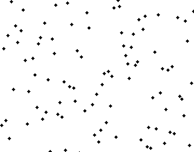
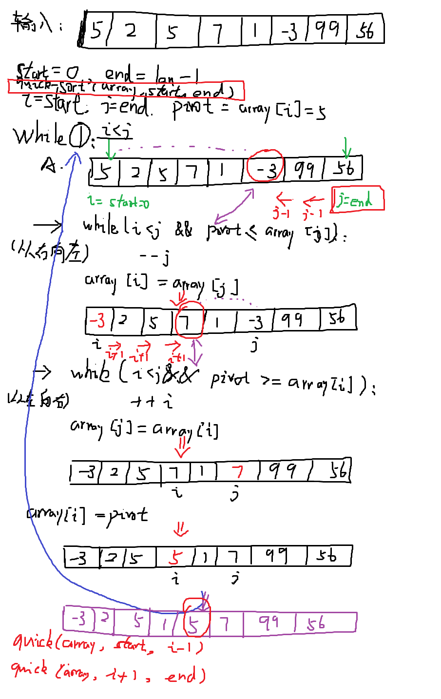

# 排序

**排序的定义**

假设含有n个记录的序列为{r1,r2,...,rn}，其相应的关键字分别是{k1,k2,...,kn}，需要确定1,2,...,n的一种排列p1,p2,...,pn，使其相应的关键字满足kp1<=kp2<=...<=kpn 非递减（或非递增）的关系，即使得序列成为一个按关键字有序的序列{rp1,rp2,...,rpn}，这样的操作就称为排序[1]。

简单来说，排序就是使输入的序列变成符合一定规则（关键字）的有序序列（非递减或非递增）。大多数遇到的排序问题都是按数据元素值的大小规则进行排序的问题。所以本文为了方便起见，只讨论数据元素值大小比较的排序问题。

**排序的稳定性**

假设ki=kj（1<=i《=n，1<=j<=n，i!=j），且在排序前的序列中ri领先于rj（即i<j）。

- 如果排序后ri仍领先于rj，则称所用的排序方法是稳定的；
- 反之，若可能使得排序后的序列中rj领先于ri，则称所用的排序方法是不稳定的。

简单来概括稳定和不稳定[2]：

- **稳定**：如果a原本在b前面，而a=b，排序之后a仍然在b前面；
- **不稳定**：如果a原本在b前面，而a=b，排序之后a可能在b的后面。

**时间和空间复杂度**

- **时间复杂度**：对排序数据的总的操作次数。反应当n变化时，操作次数呈现什么规律
- **空间复杂度**：算法在计算机内执行时所需要的存储空间的容量，它也是数据规模n的函数。

# 排序算法

排序算法可以分成两大类：

**非线性时间比较类排序**：通过比较来决定元素间的相对次序，由于其时间复杂度不能突破O(nlogn)，因此称为非线性时间比较类排序。

**线性时间非比较类排序**：不通过比较来决定元素间的相对次序，它可以突破基于比较排序的时间下界，以线性时间运行，因此称为线性时间非比较类排序。 

- <a href="#bubblesort">`冒泡排序（Bubble Sort`</a>
- <a href="#selectionsort">`选择排序（Selection Sort`</a>
- <a href="#insertionsort">`插入排序（Insertion Sort`</a>
- <a href="#shellsort">`希尔排序（Shell Sort`</a>
- <a href="#fastsort">`快速排序（Fast Sort`</a>


## 常见排序算法复杂度


<a id="bubblesort"/>

## 冒泡排序（Bubble Sort）

**基本思想**

比较相邻的两个元素，将值大的元素交换到右边（降序则相反）

**步骤：**

1. 比较相邻的元素。如果第一个比第二个大，就交换它们两个；
2. 对每一对相邻元素作同样的工作，从开始第一对到结尾的最后一对，这样在最后的元素应该会是最大的数；
3. 针对所有的元素重复以上的步骤，除了最后一个；
4. 重复步骤1~3，直到排序完成。

比如有n个元素，那么第一次比较迭代，需要比较n-1次（因为是相邻成对比较，最后一个元素没有与下一个相邻比较的对象，所以是n-1次），此次迭代完成后确定了最后一个元素为最大值；第二次比较迭代，需要比较n-2次，因为第一次迭代已经确定好了最后一个元素，所以不再需要比较；...；第 i次比较迭代，需要比较n-i次，此时确定后面i个元素是有序的较大元素；...；第n-1次比较迭代，需要比较n-(n-1)次，此时完成冒泡排序操作。

时间复杂度：o(n^2) = (n-1)*(n-1)

**动图演示：**




**过程演示：**待排序数组：{5, 4, 7, 1, 6, 2}，升序排序

\---------------------------------------

第一次循环：

第一次比较5和4，5&gt;4，交换位置：{4，5，7，1，6，2}

第二次比较5和7，5

第三次比较7和1，7&gt;1，交换位置：{4，5，1，7，6，2}

第四次比较7和6，7&gt;6，交换位置：{4，5，1，6，7，2}

第五次比较7和2，7&gt;2，交换位置：{4，5，1，6，2，7}

第一次循环完成结果：{4，5，1，6，2，7}

\----------------------------------------

第二次循环：

第一次比较4和5，4

第二次比较5和1，5&gt;1，交换位置：{4，1，5，6，2，7}

第三次比较5和6，5

第四次比较6和2，6&gt;2，交换位置：{4，1，5，2，6，7}

第五次比较6和7，6

第二次循环完成结果：{4，1，5，2，6，7}

\----------------------------------------

第三次循环：

第一次比较4和1，4&gt;1，交换位置：{1，4，5，2，6，7}

第二次比较4和5，4

第三次比较5和2，5&gt;2，交换位置：{1，4，2，5，6，7}

第四次比较5和6，5

第五次比较6和7，6

第三次循环完成结果：{1，4，2，5，6，7}

\----------------------------------------

第四次循环：

第一次比较1和4，1

第二次比较4和2，4&gt;2，交换位置：{1，2，4，5，6，7}

第三次比较4和5，4

第四次比较5和6，5

第五次比较6和7，6

第三次循环完成结果：{1，2，4，5，6，7}

\----------------------------------------

第五次循环：

第一次比较1和2，1

第二次比较2和4，2

第三次比较4和5，4

第四次比较5和6，5

第五次比较6和7，6

第三次循环完成结果：{1，2，4，5，6，7}

相信看完上面的演示过程，你对冒泡排序过程及原理有了完全的理解，但是细心的朋友应该会发现其实在第四次循环就已经得到了最终的结果，这么来看第五次循环完全是多余的，于是就有冒泡排序的改进版本：当某一轮循环当中没有交换位置的操作，说明已经排好序了，就没必要再循环了，break退出循环即可。

**复杂度分析：**

- 时间复杂度：若给定的数组刚好是排好序的数组，采用改进后的冒泡排序算法，只需循环一次就行了，此时是最优时间复杂度：O(n)，若给定的是倒序，此时是最差时间复杂度：O(n^2) ，因此综合平均时间复杂度为：O(n^2)
- 空间复杂度：因为每次只需开辟一个temp的空间，因此空间复杂度是：O(1)

**代码实现：**

- [bubble_sort.cpp](code/bubble_sort.cpp)

```c++
/* Summary: 冒泡排序
* Author: Amusi
* Date:   208-05-27
*
* Reference: 
*	http://en.wikipedia.org/wiki/Bubble_sort
*	https://github.com/xtaci/algorithms/blob/master/include/bubble_sort.h
*   https://zhuanlan.zhihu.com/p/37077924
*
* 冒泡排序说明：比较相邻的两个元素，将值大的元素交换到右边（降序则相反）
*
*/

#include <iostream>

// 冒泡函数
namespace alg{
	template<typename T>
	static void BubbleSort(T list[], int length)
	{

#if 1
		// 版本1：两层for循环 
		for (int i = 0; i < length-1; ++i)
		{ 
			for (int j = 0; j < length - i -1; ++j)
			{
				// 两两相邻元素比较大小，从小到大排序
				// if (list[j] < list[j + 1]) : 从大到小排序
				if (list[j] > list[j + 1])
				{
					int temp = list[j + 1];
					list[j + 1] = list[j];
					list[j] = temp;
				}
			}
		}

#else
		// 版本2：while+一层for循环
		bool swapped = false;
		while (!swapped)
		{
			swapped = true;
	
			for (int i = 0; i < length - 1; ++i)
			{
				// 两两相邻元素比较大小，从小到大排序
				// if (list[j] < list[j + 1]) : 从大到小排序
				if (list[i] > list[i + 1])
				{
					int temp = list[i + 1];
					list[i + 1] = list[i];
					list[i] = temp;
				}
				swapped = false;
			}
			length--;
		}
			
#endif

	}
}

using namespace std;
using namespace alg;


int main()
{
	int a[8] = { 5, 2, 5, 7, 1, -3, 99, 56 };
	BubbleSort<int>(a, 8);
	for (auto e : a)
		std::cout << e << " ";

	return 0;
}
```


- [bubble_sort.py](code/bubble_sort.py)

```python
''' Summary: 冒泡排序
* Author: Amusi
* Date:   208-05-27
*
* Reference: 
*	http://en.wikipedia.org/wiki/Bubble_sort
*	https://github.com/xtaci/algorithms/blob/master/include/bubble_sort.h
*   https://zhuanlan.zhihu.com/p/37077924
*
* 冒泡排序说明：比较相邻的两个元素，将值大的元素交换到右边（降序则相反）
*
'''

def BubbleSort(array):
    lengths = len(array)
    for i in range(lengths-1):
        for j in range(lengths-1-i):
            if array[j] > array[j+1]:
               array[j+1], array[j] = array[j], array[j+1]

    return array


array = [1,3,8,5,2,10,7,16,7,4,5]
print("Original array: ", array)
array = BubbleSort(array)
print("BubbleSort: ", array)

```

**参考：**

1 [经典排序算法之冒泡排序](http://baijiahao.baidu.com/s?id=1585931471155461767&wfr=spider&for=pc)

2 (图示版)：[来、通俗聊聊冒泡排序](https://zhuanlan.zhihu.com/p/37077924)


<a id="selectionsort"/>

## 选择排序（Selection Sort）

**基本思想**

首先在未排序序列中找到最小（大）元素，存放到排序序列的起始位置，然后，再从剩余未排序元素中继续寻找最小（大）元素，然后放到已排序序列的末尾。以此类推，直到所有元素均排序完毕。 

**步骤**

n个记录的直接选择排序可经过n-1趟直接选择排序得到有序结果。具体算法描述如下：

- 初始状态：无序区为R[1..n]，有序区为空；
- 第i趟排序(i=1,2,3…n-1)开始时，当前有序区和无序区分别为R[1..i-1]和R(i..n）。该趟排序从当前无序区中-选出关键字最小的记录 R[k]，将它与无序区的第1个记录R交换，使R[1..i]和R[i+1..n)分别变为记录个数增加1个的新有序区和记录个数减少1个的新无序区；
- n-1趟结束，数组有序化了。

**动图演示**


**复杂度分析**

- 时间复杂度：O(n2)

  注：无论什么数据进去，选择都是O(n2)的时间复杂度，所以若要使用它，建议数据规模越小越好。

- 空间复杂度：O(1)

  ​

**代码实现**

- [selection_sort.cpp](code/selection_sort.cpp)


```c++
/* Summary: 选择排序
* Author: Amusi
* Date:   208-06-22
*
* Reference: 
*   https://en.wikipedia.org/wiki/Selection_sort
*   https://github.com/xtaci/algorithms/blob/master/include/selection_sort.h
* 选择排序说明：首先在未排序序列中找到最小（大）元素，存放到排序序列的起始位置，然后，再从剩余未排序元素中继续寻找最小（大）元素，然后放到已排序序列的末尾。以此类推，直到所有元素均排序完毕。 
*
*/

#include <iostream>

// 选择排序函数
namespace alg{
	template<typename T>
	static void SelectionSort(T list[], int length)
	{
		// 外循环: length-1次，因为当length-1个元素排序好后，第length个元素位置不再变化
		for (int i = 0; i < length-1; ++i)
		{ 
			int minIndex = i;
			// 从i的位置，进行遍历，因为前i-1个元素已经排序好
			for (int j = i; j < length; ++j)
			{
				// 每次从未排序的数组中选出最小的值放入已排序的数组中，即从小到大排序
				if (list[j] < list[minIndex])
				{
					minIndex = j;
				}
			}
			int temp = list[minIndex];
			list[minIndex] = list[i];
			list[i] = temp;
		}

	}
}

using namespace std;
using namespace alg;


int main()
{
	int a[8] = { 5, 2, 5, 7, 1, -3, 99, 56 };
	SelectionSort<int>(a, 8);
	for (auto e : a)
		std::cout << e << " ";

	return 0;
}
```


- [selection_sort.py](code/selection_sort.py)


```python
''' Summary: 选择排序
* Author: Amusi
* Date:   208-06-22
*
* Reference: 
*   https://en.wikipedia.org/wiki/Selection_sort
*
* 选择排序说明：首先在未排序序列中找到最小（大）元素，存放到排序序列的起始位置，然后，再从剩余未排序元素中继续寻找最小（大）元素，然后放到已排序序列的末尾。以此类推，直到所有元素均排序完毕。 
*
'''

def SelectionSort(array):
    lengths = len(array)
    for i in range(lengths-1):
        min_index = i
        for j in range(i, lengths):
            if array[j] < array[min_index]:
               min_index = j
        array[i], array[min_index] = array[min_index], array[i]
		
    return array


array = [1,3,8,5,2,10,7,16,7,4,5]
print("Original array: ", array)
array = SelectionSort(array)
print("SelectionSort: ", array)

```


<a id="insertionsort"/>

## 插入排序（Insertion Sort）

**基本思想**

插入排序（insertion sort）又称直接插入排序（staright insertion sort），其是将未排序元素一个个插入到已排序列表中。对于未排序元素，在已排序序列中从后向前扫描，找到相应位置把它插进去；在从后向前扫描过程中，需要反复把已排序元素逐步向后挪，为新元素提供插入空间。

**步骤**

1. 从第一个元素开始，该元素可以认为已经被排序；
2. 取出下一个元素（未排序），在已经排序的元素序列中从后向前扫描；
3. 如果该元素（已排序）大于新元素，将该元素移到下一位置（往前移动）；
4. 重复步骤3，直到找到已排序的元素小于或者等于新元素的位置；
5. 将新元素插入到该位置后；
6. 重复步骤2~5。

**动图演示**


**复杂度分析**

- 时间复杂度：最坏O(n2)、平均O(n2)、最差O(n)
- 空间复杂度：O(n1)
- 稳定性：稳定

举个例子（暴力手绘图）


**代码实现**

- [insertion_sort.cpp](code/insertion_sort.cpp)


```c++
/* Summary: 插入排序（Insertion Sort）
* Author: Amusi
* Date:   2018-07-16
*
* Reference: 
*   https://en.wikipedia.org/wiki/Insertion_sort
*	
* 插入排序（insertion sort）又称直接插入排序（staright insertion sort），其是将未排序元素一个个插入到已排序列表中。对于未排序元素，在已排序序列中从后向前扫描，找到相应位置把它插进去；在从后向前扫描过程中，需要反复把已排序元素逐步向后挪，为新元素提供插入空间。
*
*/

#include <iostream>

// 插入排序函数
namespace alg{
	template<typename T>
	static void InsertionSort(T list[], int length)
	{
		// 从索引为1的位置开始遍历
		for (int i = 1; i < length; ++i)
		{
			T currentValue = list[i];	// 保存当前值
			int preIndex = i - 1;	// 前一个索引值
			// 循环条件: 前一个索引值对应元素值大于当前值 && 前一个索引值大于等于0
			while (list[preIndex] > currentValue && preIndex >= 0){
				list[preIndex + 1] = list[preIndex];
				preIndex--;
			}
			list[preIndex + 1] = currentValue;
		}
	}
}

using namespace std;
using namespace alg;


int main()
{
	int a[8] = { 5, 2, 5, 7, 1, -3, 99, 56 };
	InsertionSort<int>(a, 8);
	for (auto e : a)
		std::cout << e << " ";

	return 0;
}
```


- [insertion_sort.py](code/insertion_sort.py)

```python
''' Summary: 插入排序（Insertion Sort）
* Author: Amusi
* Date:   208-07-16
*
* Reference: 
*   https://en.wikipedia.org/wiki/Insertion_sort
*   https://www.cnblogs.com/wujingqiao/articles/8961890.html
*	
* 插入排序（insertion sort）又称直接插入排序（staright insertion sort），其是将未排序元素一个个插入到已排序列表中。对于未排序元素，在已排序序列中从后向前扫描，找到相应位置把它插进去；在从后向前扫描过程中，需要反复把已排序元素逐步向后挪，为新元素提供插入空间。
*
'''

def InsertionnSort(array):
    lengths = len(array)
    # 从索引位置1开始
    for i in range(1, lengths):
        currentValue = array[i] # 当前索引对应的元素数值
        preIndex = i-1		     # 前一个索引位置
        # 循环条件: 前一个索引对应元素值大于当前值，前一个索引值大于等于0
        while array[preIndex] > currentValue and preIndex>=0:
        	array[preIndex+1] = array[preIndex]	# 前一个索引对应元素值赋值给当前值
        	preIndex -= 1	# 前一个索引位置-1
        # preIndex+1，实现元素交换
        array[preIndex+1] = currentValue
		
    return array


array = [1,3,8,5,2,10,7,16,7,4,5]
print("Original array: ", array)
array = InsertionnSort(array)
print("InsertionnSort: ", array)

```


<a id="shellsort"/>

## 希尔排序（Shell Sort）

**基本思想**

- [ ] TODO


注：在希尔排序算法提出之前，排序算法的时间复杂度都为O(n^2)，如冒泡排序、选择排序和插入排序。而希尔排序算法是突破这个时间复杂度的第一批算法之一。该复杂度为O(nlogn)，其实直接插入排序算法的改进版。

**步骤**

**动图演示**

)

**复杂度分析**


**代码实现**


<a id="fastsort"/>

## 快速排序（Quick Sort）

**基本思想**

[快速排序（quick sort）](https://en.wikipedia.org/wiki/Quicksort)：通过一趟排序将待排列表分隔成独立的两部分，其中一部分的所有元素均比另一部分的所有元素小，则可分别对这两部分继续重复进行此操作，以达到整个序列有序。（这个过程，我们可以使用递归快速实现）

**步骤**

快速排序使用分治法来把一个串（list）分为两个子串（sub-lists）。具体算法描述如下：

- 从数列中挑出一个元素，称为 “基准”（pivot），这里我们通常都会选择第一个元素作为prvot；
- 重新排序数列，将比基准值小的所有元素放在基准前面，比基准值大的所有元素放在基准的后面（相同的数可以到任一边）。这样操作完成后，该基准就处于新数列的中间位置，即将数列分成了两部分。这个操作称为分区（partition）操作；
- 递归地（recursive）把小于基准值元素的子数列和大于基准值元素的子数按上述操作进行排序。这里的递归结束的条件是序列的大小为0或1。此时递归结束，排序就完成了。

**动图演示**


**复杂度分析**

- 时间复杂度：
  - 平均情况：O(nlogn)
  - 最好情况：O(nlong)
  - 最坏情况：O(n^2)
    其实不难理解，快排的最坏情况就已经退化为冒泡排序了！所以大家深入理解就会发现各个排序算法是相通的，学习时间久了你就会发现它们的内在联系！是不是很神奇哈～
- 空间复杂度：
  - 平均情况：O(logn)
  - 最好情况：O(logn)
  - 最坏情况：O(n)
- 稳定性：不稳定 （由于关键字的比较和交换是跳跃进行的，所以快速排序是一种不稳定的排序方法～）

举个例子（暴力手绘图）




**代码实现**

注：下面都是利用递归法实现快速排序。

[quick_sort.cpp](code/quick_sort.cpp)

```c++
/* Summary: 快速排序（Quick Sort）
* Author: Amusi
* Date:   2018-07-28
*
* Reference: 
*   https://en.wikipedia.org/wiki/Quicksort
*	
* 快速排序（quick sort）：通过一趟排序将待排列表分隔成独立的两部分，其中一部分的所有元素均比另一部分的所有元素小，则可分别对这两部分继续重复进行此操作，以达到整个序列有序。（这个过程，我们可以使用递归快速实现）
*
*/

#include <iostream>

// 快速排序函数（递归法）
namespace alg{
	template<typename T>
	static void QuickSort(T list[], int start, int end)
	{
		int i = start;
		int j = end;
		// 结束排序（左右两索引值见面，即相等，或者左索引>右索引）
		if (i >= j)
			return;
		// 保存首个数值（以首个数值作为基准）
		// 这个位置很重要，一定要在if i >= j判断语句之后，否则就索引溢出了
		T pivot = list[i];

		// 一次排序，i和j的值不断的靠拢，然后最终停止，结束一次排序
		while (i < j){
			// 一层循环实现从左边起大于基准的值替换基准的位置，右边起小于基准的值位置替换从左起大于基准值的索引
			//（从右往左）和最右边的比较，如果 >= pivot, 即满足要求，不需要交换，然后j - 1，慢慢左移，即拿基准值与前一个值比较; 如果值<pivot，那么就交换位置
			while (i < j && pivot <= list[j])
				--j;
			list[i] = list[j];
			// 交换位置后，（从左往右）然后在和最左边的值开始比较，如果 <= pivot, 然后i + 1，慢慢的和后一个值比较; 如果值>pivot，那么就交换位置
			while (i < j && pivot >= list[i])
				++i;
			list[j] = list[i];
		}
		// 列表中索引i的位置为基准值，i左边序列都是小于基准值的，i右边序列都是大于基准值的，当前基准值的索引为i，之后不变
		list[i] = pivot;
		// 左边排序
		QuickSort(list, start, i-1);
		// 右边排序
		QuickSort(list, i+1, end);
	}
}

using namespace std;
using namespace alg;


int main()
{
	int a[8] = { 5, 2, 5, 7, 1, -3, 99, 56 };
	QuickSort<int>(a, 0, sizeof(a)/sizeof(a[0]) - 1);
	for (auto e : a)
		std::cout << e << " ";

	return 0;
}
```


[quick_sort.py](code/quick_sort.py)

```python
''' Summary: 快速排序（Quick Sort）
* Author: Amusi
* Date:   208-07-28
*
* Reference: 
*   https://en.wikipedia.org/wiki/Quicksort
*   https://www.cnblogs.com/wujingqiao/articles/8961890.html
*	https://github.com/apachecn/LeetCode/blob/master/src/py3.x/sort/QuickSort.py
*   快速排序（quick sort）：通过一趟排序将待排列表分隔成独立的两部分，其中一部分的所有元素均比另一部分的所有元素小，则可分别对这两部分继续重复进行此操作，以达到整个序列有序。（这个过程，我们可以使用递归快速实现）
*
'''

def QuickSort(array, start, end):
    lengths = len(array)
    i = start
    j = end
    # 结束排序（左右两索引值见面，即相等，或者左索引>右索引）
    if i >= j:
        return	# 返回空即可
    # 保存首个数值（以首个数值作为基准）
	# 这个位置很重要，一定要在if i>=j判断语句之后，否则就索引溢出了
    pivot = array[i]
    # 一次排序，i和j的值不断的靠拢，然后最终停止，结束一次排序
    while i < j:
        # （从右往左）和最右边的比较，如果>=pivot,即满足要求，不需要交换，然后j-1，慢慢左移，即拿基准值与前一个值比较; 如果值<pivot，那么就交换位置
        while i < j and pivot <= array[j]:
            # print(pivot, array[j], '*' * 30)
            j -= 1
        array[i] = array[j]
        # 交换位置后，然后在和最左边的值开始比较，如果<=pivot,然后i+1，慢慢的和后一个值比较;如果值>pivot，那么就交换位置
        while i < j and pivot >= array[i]:
            # print(pivot, array[i], '*' * 30)
            i += 1
        array[j] = array[i]
    # 列表中索引i的位置为基准值，i左边序列都是小于基准值的，i右边序列都是大于基准值的，当前基准值的索引为i，之后不变
    array[i] = pivot
    # 左边排序
    QuickSort(array, start, i-1)
    # 右边排序
    QuickSort(array, i+1, end)
		
    #return array

if __name__ == "__main__":
    array = [1,3,8,5,2,10,7,16,7,4,5]
    print("Original array: ", array)
    #array = QuickSort(array, 0, len(array)-1)
	# 因为python中的list对象是可变对象，所以在函数做"形参"时，是相当于按引用传递
	# 所以不写成返回值的形式，也是OK的
    QuickSort(array, 0, len(array)-1)
    print("QuickSort: ", array)

```


# 参考

**[1]（推荐）**[《大话数据结构》](https://book.douban.com/subject/6424904/)

**[2]（推荐）**[十大经典排序算法（动图演示）](https://www.cnblogs.com/onepixel/p/7674659.html)

**[3]（推荐）**[轻松搞定十大排序算法(C++版)](https://blog.csdn.net/opooc/article/details/80994353)

**[4]（推荐）**[从头说12种排序算法：原理、图解、动画视频演示、代码以及笔试面试题目中的应用](https://blog.csdn.net/han_xiaoyang/article/details/12163251)

**[5]（推荐）**[排序算法时间复杂度、空间复杂度、稳定性比较](https://blog.csdn.net/yushiyi6453/article/details/76407640)

**[6]（推荐）**[十大排序算法和七大查找算法总结（原理讲解和Python代码实现）---（一）排序算法篇](https://www.cnblogs.com/wujingqiao/p/8961890.html)

**[7]** [常见排序算法C++总结](https://www.cnblogs.com/zyb428/p/5673738.html)

**[8]** [十大经典排序算法（JavaScript版）](http://web.jobbole.com/87968/)

**[9]** [八大排序算法总结（JAVA版）](http://www.runoob.com/w3cnote/sort-algorithm-summary.html)

**[10]** [C++代码](https://github.com/xtaci/algorithms/blob/master/include/selection_sort.h)